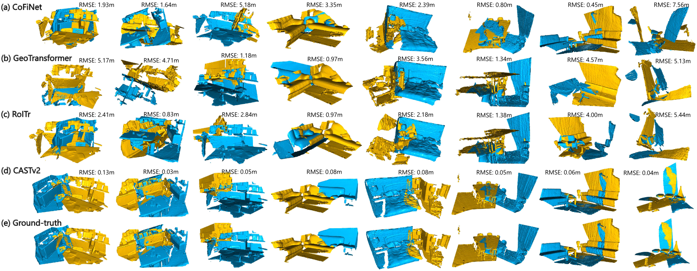

## CASTv2: Consistency-Aware Spot-Guided Transformer for Accurate and Versatile Point Cloud Registration

Official PyTorch implementation of the paper ''Consistency-Aware Spot-Guided Transformer for Accurate and Versatile Point Cloud Registration'', which is the improved version of [''A Consistency-Aware Spot-Guided Transformer for Versatile and Hierarchical Point Cloud Registration''](https://arxiv.org/abs/2410.10295) accepted by NeurIPS 2024 as poster.

### 1. Introduction

we design a consistency-aware spot-guided Transformer (CAST) explicitly based on both local and global geometric consistency. Specifically, we propose spot-guided cross-attention to avoid interfering with irrelevant areas, and consistency-aware self-attention to enhance matching capabilities with consistent correspondences. Furthermore, we design a lightweight local attention-based fine matching module to precisely predict dense correspondences and estimate the transformation. Extensive experiments on both outdoor LiDAR point cloud datasets and indoor RGB-D point cloud datasets demonstrate that our method achieves *state-of-the-art* accuracy, efficiency, and robustness. Besides, our method showcases superior generalizability on our newly constructed challenging relocalization and loop closing benchmarks in unseen domains.


### 2. Installation

Please use the following command for installation.

```bash
# It is recommended to create a new environment
conda create -n cast python==3.7
conda activate cast

# Install packages and other dependencies
pip install -r requirements.txt

# If you are using CUDA 11.2 or newer, you can install `torch==1.7.1+cu110` or `torch=1.9.0+cu111`
pip install torch==1.9.0+cu111 -f https://download.pytorch.org/whl/torch_stable.html

# Install pytorch3d (feel free to download it to other directories)
conda install openblas-devel -c anaconda
wget https://github.com/facebookresearch/pytorch3d/archive/refs/tags/v0.6.2.zip
mv v0.6.2.zip pytorch3d-0.6.2.zip
unzip pytorch3d-0.6.2.zip
cd pytorch3d-0.6.2
pip install -e . 
cd ..

# Install MinkowskiEngine (feel free to download it to other directories)
git clone https://github.com/NVIDIA/MinkowskiEngine
cd MinkowskiEngine
python setup.py install --blas_include_dirs=${CONDA_PREFIX}/include --blas=openblas

# Download pre-trained weights from release v1.0.0
```

Code has been tested with Ubuntu 20.04, GCC 9.4.0, Python 3.7, PyTorch 1.9.0, CUDA 11.2 and PyTorch3D 0.6.2.


### 3. KITTI odometry

#### Data preparation

Download the data from the [KITTI official website](http://www.cvlibs.net/datasets/kitti/eval_odometry.php). The data should be organized as follows:
- `KITTI`
    - `velodyne` (point clouds)
        - `sequences`
            - `00`
                - `velodyne`
                    - `000000.bin`
                    - ...
            - ...
    - `results` (poses)
        - `00.txt`
        - ...
    - `sequences` (sensor calibration and time stamps)
        - `00`
            - `calib.txt`
            - `times.txt`
        - ...

Please note that we have already generated the information of pairwise point clouds via ``./data/gen_kitti_data.py``, which is stored in ``./data/kitti_list``. Feel free to use it directly or re-generate the information by yourselves.

#### Training
After modifying the ```data.root``` item to your dataset path in ```./config/kitti.json```, you can use the following command for training.
```bash
python trainval.py --mode train --config ./config/kitti.json
```

#### Testing
After modifying the ```data.root``` item to your dataset path in ```./config/kitti.json```, you can use the following command for testing.
```bash
python trainval.py --mode test --config ./config/kitti.json --load_pretrained cast-epoch-40
```

#### Qualitative results
You can use the following command for visualization:
```bash
# visualize the sparse correspondences
python demo_outdoor.py --dataset kitti --mode corr --load_pretrained cast-epoch-40 --split train --id 208
# visualize the aligned point clouds after pose estimation
python demo_outdoor.py --dataset kitti --mode reg --load_pretrained cast-epoch-40 --split train --id 208
```


### 4. nuScenes

#### Data preparation

Download the data from the [nuScenes official website](https://www.nuscenes.org/nuscenes#download). The data should be organized as follows:
- `nuscenes`
    - `samples`
        - `LIDAR_TOP`
            - `n008-2018-05-21-11-06-59-0400__LIDAR_TOP__1526915243047392.pcd.bin`
            - ...

#### Training
After modifying the ```data.root``` item to your dataset path in ```./config/nuscenes.json```, you can use the following command for training.
```bash
python trainval.py --mode train --config ./config/nuscenes.json
```

#### Testing
After modifying the ```data.root``` item to your dataset path in ```./config/nuscenes.json```, you can use the following command for testing.
```bash
python trainval.py --mode test --config ./config/nuscenes.json --load_pretrained cast-epoch-04-24000
```

#### Qualitative results
```bash
# visualize the sparse correspondences
python demo_outdoor.py --dataset nuscenes --mode corr --load_pretrained cast-epoch-04-24000 --split train --id 0
# visualize the aligned point clouds after pose estimation
python demo_outdoor.py --dataset nuscenes --mode reg --load_pretrained cast-epoch-04-24000 --split train --id 0
```


### 5. 3DMatch and 3DLoMatch

#### Data preparation

The dataset can be downloaded from [PREDATOR](https://github.com/prs-eth/OverlapPredator) (by running the following commands):
```bash
wget --no-check-certificate --show-progress https://share.phys.ethz.ch/~gsg/pairwise_reg/3dmatch.zip
unzip 3dmatch.zip
```
The data should be organized as follows:
- `3dmatch`
    - `train`
        - `7-scenes-chess`
            - `fragments`
                - `cloud_bin_*.ply`
                - ...
            - `poses`
                - `cloud_bin_*.txt`
                - ...
        - ...
    - `test`
        - `7-scenes-redkitchen`
            - `fragments`
                - `cloud_bin_*.ply`
                - ...
            - `poses`
                - `cloud_bin_*.txt`
                - ...
        - ...

#### Training
After modifying the ```data.root``` item to your dataset path in ```./config/3dmatch.json```, you can use the following command for training.
```bash
python trainval.py --mode train --config ./config/3dmatch.json
```

#### Testing
After modifying the ```data.root``` item to your dataset path in ```./config/3dmatch.json```, you can use the following command for testing.
```bash
# evaluate the registration recall
## for 3DMatch benchmark
python benchmark_indoor.py --benchmark 3DMatch --config ./config/3dmatch.json --load_pretrained cast-epoch-08-7500
## for 3DLoMatch benchmark
python benchmark_indoor.py --benchmark 3DLoMatch -config ./config/3dmatch.json --load_pretrained cast-epoch-08-7500
```


#### Qualitative results
You can use the following command for visualization:
```bash
python demo_indoor.py --split test --benchmark 3DMatch --id 0
```



### 6. Generalization to KITTI-360 and MulRan

#### Data preparation

The KITTI-360 dataset can be downloaded [here](https://www.cvlibs.net/datasets/kitti-360/user_login.php), which is organized as follows:
- `KITTI-360`
    - `data_3d_raw`
        - `2013_05_28_drive_0000_sync`
            - `velodyne_points`
                - `timestamps.txt`
                - `data` (raw point clouds stored as `xxx.bin`)
        - `2013_05_28_drive_0002_sync`
        - `2013_05_28_drive_0003_sync`
        - `2013_05_28_drive_0004_sync`
        - `2013_05_28_drive_0005_sync`
        - `2013_05_28_drive_0006_sync`
        - `2013_05_28_drive_0007_sync`
        - `2013_05_28_drive_0009_sync`
        - `2013_05_28_drive_0010_sync`
    - `data_poses`
        - `2013_05_28_drive_0000_sync`
        - `2013_05_28_drive_0002_sync`
        - `2013_05_28_drive_0003_sync`
        - `2013_05_28_drive_0004_sync`
        - `2013_05_28_drive_0005_sync`
        - `2013_05_28_drive_0006_sync`
        - `2013_05_28_drive_0007_sync`
        - `2013_05_28_drive_0009_sync`
        - `2013_05_28_drive_0010_sync`
    - `calibration`
        - `calib_cam_to_velo.txt`

The MulRan dataset can be downloaded [here](https://sites.google.com/view/mulran-pr/download), which is organized as follows:
- `MulRan`
    - `DCC01`
        - `global_pose.csv`
        - `sensor_data`
            - `Ouster` (raw point clouds stored as `xxx.bin`)
            - `ouster_front_stamp.csv`
            - `data_stamp.csv`
    - `DCC02`
    - `DCC03`
    - `KAIST01`
    - `KAIST02`
    - `KAIST03`
    - `Riverside01`
    - `Riverside02`
    - `Riverside03`


#### Testing
You can use the following commands to evaluate our model on the relocalization or the loop closing benchmark on the KITTI-360 or the MulRan dataset:
```bash
python benchmark_generalization.py --dataset kitti360_reloc --root YOUR_DATASET_ROOT
python benchmark_generalization.py --dataset kitti360_loop --root YOUR_DATASET_ROOT
python benchmark_generalization.py --dataset mulran_reloc --root YOUR_DATASET_ROOT
python benchmark_generalization.py --dataset mulran_reloc --root YOUR_DATASET_ROOT
```

## Citations
```
@inproceedings{neurips2024cast,
 author = {Huang, Renlang and Tang, Yufan and Chen, Jiming and Li, Liang},
 booktitle = {Advances in Neural Information Processing Systems},
 pages = {70230--70258},
 publisher = {Curran Associates, Inc.},
 title = {A Consistency-Aware Spot-Guided Transformer for Versatile and Hierarchical Point Cloud Registration},
 volume = {37},
 year = {2024}
}
```

## Acknowledgements
We would like to thank the authors of [D3Feat](https://github.com/XuyangBai/D3Feat.pytorch), [PREDATOR](https://github.com/prs-eth/OverlapPredator), [PointDSC](https://github.com/XuyangBai/PointDSC), [HRegNet](https://github.com/ispc-lab/HRegNet2), [GeoTransformer](https://github.com/qinzheng93/GeoTransformer), and [REGTR](https://github.com/yewzijian/RegTR) for making their source codes public.
